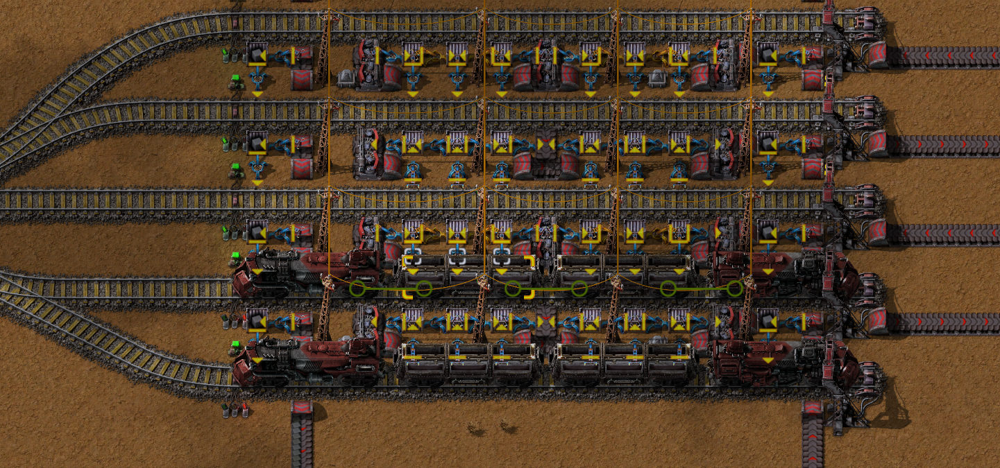
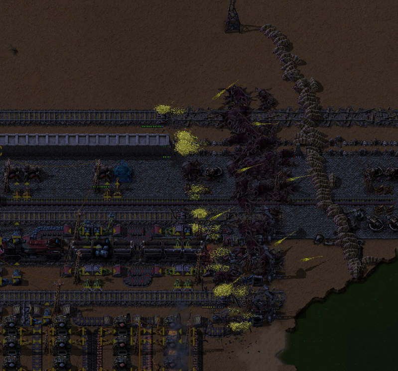

# Sunday October 20th, 2024

## Another reconsideration of `winapi` / `windows`

[Rust 1.82.0](https://blog.rust-lang.org/2024/10/17/Rust-1.82.0.html) introduced
[Safe items with `unsafe extern`](https://blog.rust-lang.org/2024/10/17/Rust-1.82.0.html#safe-items-with-unsafe-extern).

This has me thinking about windows API bindings again.
Thinking about [`GetDesktopWindow`](https://learn.microsoft.com/en-us/windows/win32/api/winuser/nf-winuser-getdesktopwindow):
*   Can it fail?
    *   If the current `WINSTA` is locked down?  Or would `winuser.dll` crash on load?
    *   In the context of a service?
    *   On some WINE port?
    *   During windows shutdown / if no `explorer.exe` is running?
    *   On Xbox One where it might be a stub?
    *   Does it `SetLastError` if it does?
        *   On all errors, or just some?
        *   On successes too?
*   Requirements:
    *   `#include <windows.h>`?
    *   `winuser.dll`?
    *   Windows Version?
    *   Not in an `.appx`?
    *   Not in a driver?  (`winusb.h` calls OTOH *must* be in a driver?)

Many of these concerns won't be covered by my Windows SDK scanning, although I've been thinking about that again too.
Microsoft has been pushing:
*   <https://github.com/microsoft/win32metadata>
*   <https://github.com/microsoft/wdkmetadata>

"But I want JSON tho" I thought grimly to myself.  Fortunately that does seem to be an available option / projection:
*   <https://github.com/marlersoft/win32json> (generated by <https://github.com/marlersoft/win32jsongen>, as linked from <https://github.com/microsoft/win32metadata/blob/main/docs/projections.md>)

I'm imagining validation via codegen.  Remember e.g. `CONTEXT`'s alignment bugs.

There is also:
*   <https://github.com/microsoft/WindowsAppSDK>
*   <https://github.com/microsoft/DirectX-Headers>
*   <https://github.com/microsoft/Windows-classic-samples>
*   <https://github.com/MaulingMonkey/windows-sdk-scanner>

## Another reconsideration of a web/wasm/distributed "OS"

To gain native access...
*   `drivers/common/*.wasm`
*   `drivers/browser/*.js`
*   `drivers/windows/{x86,x64}/*.{exe,dll}`
*   `drivers/linux/{x86,x64}/{*,lib*.so}`

RPC-esque protocol definition files?

I want top level storage spaces that control:
*   Duplication (e.g. notes should be highly available / redundantly stored on ~all machines, media might be safe to just have on NAS and another computer)
*   Deduplication (file hashes, ...)
*   History preservation
*   Resource utilization/quotas
*   Visibility (most apps shouldn't have access to my tax records)

## Determining narrow encoding

*   Breakpoint [`MultiByteToWideChar`] to see what `CP_*` value `CodePage` is set to.
*   Use e.g. [`MessageBoxA`] as a demo to verify this technique works.
*   Document.

<!-- References -->

[`MultiByteToWideChar`]:        https://learn.microsoft.com/en-us/windows/win32/api/stringapiset/nf-stringapiset-multibytetowidechar
[`MessageBoxA`]:                https://learn.microsoft.com/en-us/windows/win32/api/winuser/nf-winuser-messageboxa

# Saturday October 26th, 2024

## Factorio Space Age!

Lots of fun.
Achievements and trains keep nerd sniping me.
<https://wiki.factorio.com/Achievements>

### Micro Train Stations
-   <https://forums.factorio.com/viewtopic.php?p=611099#p611099>
-   Weave undergrounds in single lane order: `[underground, inserter, chest, chest, inserter, underground]`
-   Sadly incompatible with oil pumps.  Two lanes can unload to the outside, but for a third lane, switch stride from 2 → 3.

### Outpost Power
-   Instead of transporting fuel + water, transport steam for massively simplified logistics.

### Desert Islands World
-   Walls, Gates
-   Semi-rush bots?
-   Semi-rush flamethrowers?
-   Keep expansion enabled.
-   Don't aim for "kill your first biter base with artillery" achievement, too obnoxious for early game.

### Water Islands World
-   Disable biter expansion / use rail world preset
-   Crank water up to 200%+ for islands with new mapgen.
-   Don't have to use "Island" mapgen which results in only a single main island.
-   Ideal for "kill your first biter base with artillery" achievement, if you crank up starting area.

# Sunday October 27th, 2024

## Mistakes in Factorio!
-   Defensive play spirals on me.  Again.  Even swarms of small biters can damage my main base corners.
-   Stay offensive until construction robotics can automate repairs?
-   Micro train station inserters both insert onto same side.  Mid-way lane switch possible but awkward.
-   On the plus side, rail *is* fast to move around in.
-   Interior rail loop saner
-   Have a centerish gate instead of trying to turn right next to exterior wall, takes up too much defensive space.
-   Don't have a 1 rail width island for rail entrance/exit @ wall.  Too weak.
-   Get flamethrower turrets faster, or at least stockpile oil specifically for said flamethrower turrets instead of turning it all to plastic.
-   Tank requires blue science.

## Factorio Compact Stations
I foolishly like my 1-2-1 trains and compact 1 rail-width gaps.
My loader and unloader designs can saturate a red belt when using bulk inserters.

# Monday October 28th, 2024

Went over some old/abandoned Factorio worlds.

## Factorio World Rescues: Desert Worlds ("Dune"?)

Was constantly hemmoraging defenses.  Couldn't fuel flamethrower turrets.

Abandoned defense spiral.
-   Lost turrets.
-   Lost *lots* of walls.
-   Lost tracks.
-   Lost an ore train.
-   Lost a station.
-   Lost a radar.
-   Lost oil pumpjacks.
-   Gained time.

Went offensive with the car.
-   Dumped 1k red ammo into biters in ≈20 minutes.
-   Rocks are the great killer.
-   Many intimidating-looking swarms can be whittled down and respawn slowly.
-   Slow pokes once population stabilized.
-   Turret spam is expensive and slow.

Evolution was ≈ 20% time, 20% kills, 60% pollution.
-   Should've gone offensive earlier.

Aftermath:
-   Biter spawner absorption is *mostly* reset.
-   Rebuilt defenses, tracks.
-   Still need to rebuild ore train, oil.
-   Station unloaders could be reworked.
-   Remote steam power is silly.  Just run redundant power lines.

## Factorio World Rescues:  Foolish defensive desert nonsense ("TPC"?)

Was aiming for "Keeping your hands clean" [achievement](https://wiki.factorio.com/Achievements).
Probably a bad idea to disallow killing biter bases on a desert map with enemy expansion on.
Big resource drain.
That said, my resource pains weren't actually resource pains: Military science was stalled at 35% flamethrower turret research.
This was due to incorrect labratory feeding setup:
-   Tried to use long-arm inserters for all 3 lanes after a 2 tile gap, but that doesn't work (doesn't reach labs.)
-   Can alternatively do do 3 lanes, 1 tile gap.

## Open Questions
-   1 radar can be ≈fully powered during the day with 6 solar panels.  If I don't care about long distance scans / night visibility, does 1 solar panel suffice for spam?
-   Is [/r/factorio](https://www.reddit.com/r/factorio/) any good?
-   Experiment with overflow/trash buffers?  Designs
-   Roundbouts with single straights for nice 1-1-1 bidirectional rail?
-   Re-check yellow/red belt limits with blue assemblers.
-   Module up some space platform stuff?

## What to rush?
-   🔴:
    Turrets (defense),
    Military 1 (SMG).
-   🔴🟢:
    Cars (critical for early base pruning),
    power poles  (3x3 is way less obnoxious vs 2x2),
    Military 2 (Red Ammo + Grenades, Military Science Ingredients),
    ~~Trains~~ (Mostly just nerd snipes me),
    Red Belts (when bottlenecked / for cars.)
-   🔴🟢⚫: Flamethrowers!
-   🔴🟢🔵:
    Construction robots!
    Advanced Oil Processing
-   🔴🟢⚫🔵:
    Tanks?
-   🔴🟢🔵⚪:
    Advanced logistics!  (Unless going for the no-logistics achievement.)
-   ?:
    Quality modules?

## Other Lessons Learned
-   Treating oil refining as "another smelter" works great for coal → plastic.
-   Also nearby for iron + copper → sulfuric acid → batteries?

# Tuesday October 29th, 2024

## Misc.
-   Git-only notes is obnoxious from a non-dev computer.
    -   Clearly I need to hurry up and setup my web/wasm OS.
-   Running out of Bawls is terrible.
-   Ran across <https://docs.rs/safer-ffi/>

## Factorio Combat Notes

The first attack will probably come from an easy base where the biters expanded into you.
Pushing into contact with:
-   An SMG
-   A stack of yellow ammo
-   A couple dozen turrets crafting
-   1k yellow ammo crafting

And then doing a ≈15 minute neighbor clearing perimiter sweep is an excellent strategy.

## For consideration

-   In a rail world, a low production / pollution run might be the way to go to get the artillery achievement.
    Slow burn for the win?
    Map out critical path of technology?
    Just need to get to Vulcanus and research.
-   KoS instead went [≈ tweaked rail world settings](https://youtu.be/f9mKBApRUMc?t=1555)
